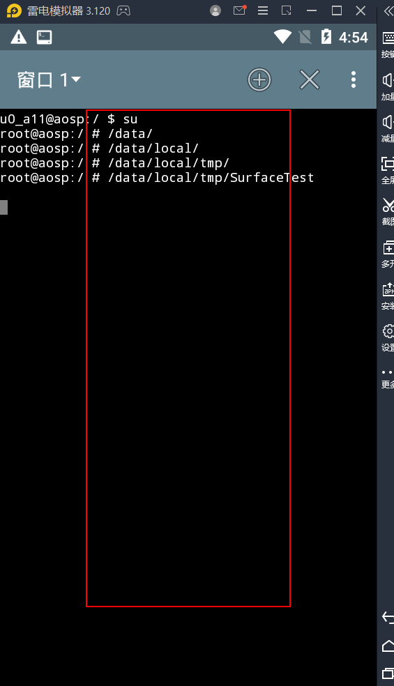

# Android_executable_draw
可执行文件+skia绘制


首先需要搭建aosp环境,雷电模拟器以Android5.1为例
编译aosp可以参考这个视频:
https://www.bilibili.com/video/BV1gU4y1j7JY?from=search&seid=5741363526410662528&spm_id_from=333.337.0.0

编译系统后,在external目录将test拷贝过来
在android目录下执行
```
source build/envsetup.sh
lunch 5 (x86版本)
mmm external/test/
```
然后根据生成信息将可执行文件拷贝到设备里
进入对应目录后
```
chmod 777 SurfaceTest
./SurfaceTest
```
